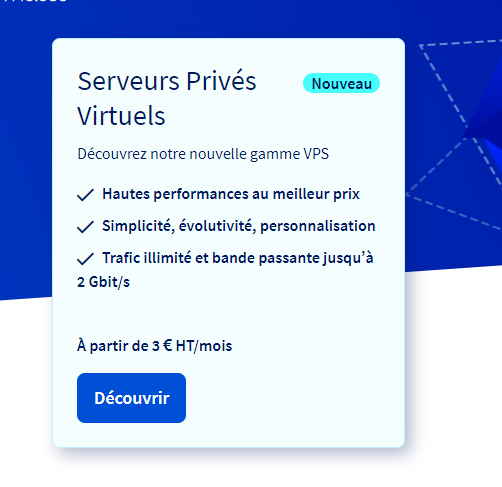
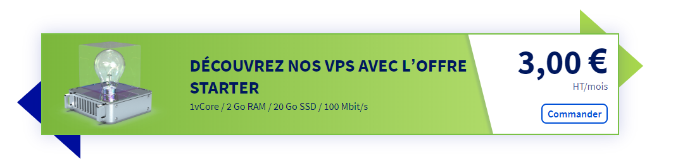
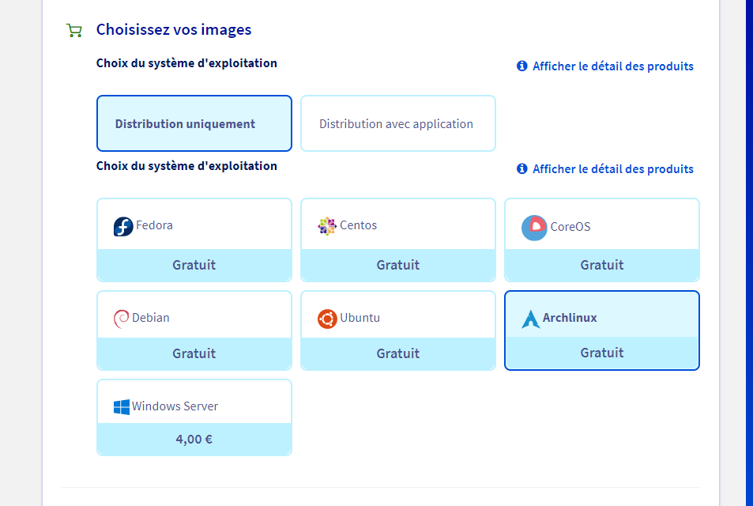
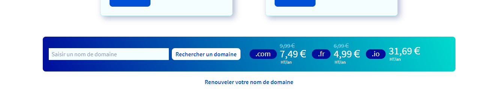
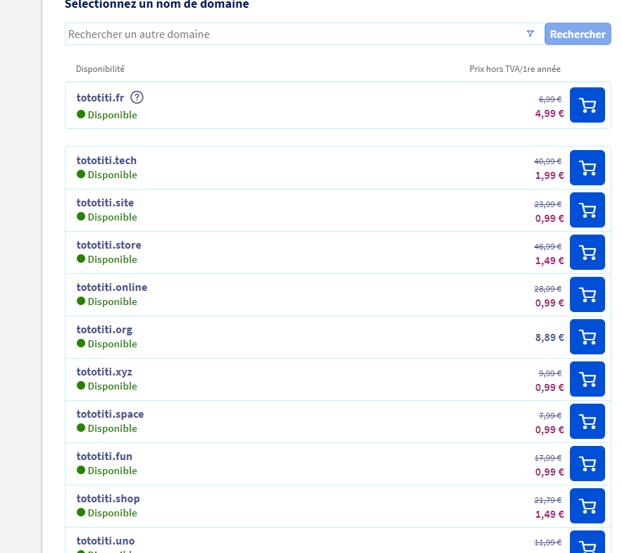
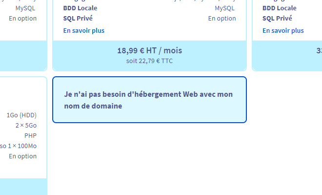

Tuto mise en place d'un serveur basique.
=======================================

But du tuto
-----------
Apprendre à configurer un petit serveur personnel. 

- Commande de base de linux.
- Configuration pour lié son serveur à son nom de domaine.
- Connexion en ssh sur le serveur.
- Configuration rapide pour un peu plus de sécurité.
- Mise en place d'un serveur Nginx.
- Faire apparaitre un hello word en ligne.

Achat d'un VPS sur OVH
----------------------
Pour effectuer se tuto, vous aurez besoin d'un serveur vierge. Il existe bien des manières
pour obtenir un serveur. Pour ma part, je trouve qu'un petit VPS de chez OVH est peu onéreux
et permet de débuter convenablement.

Rendez-vous donc sur Ovh.com

- Choisir l'encadrer "Serveur privé virtuel"

- Allez ensuite sur "Decouvrez nos VPS avec l'offre Starter"

Il vous en coutera la modique somme de 3€ par mois. Ne vous attendez pas à un monstre de 
puissance pour ce prix, mais ça à le mérite d'être là et de faire le taff.

- Selectionner ensuite l'image du système d'exploitation "Distribution uniquement" -> Archlinux

Si vous préférer prendre une autre distribution, n'hésitez pas, mais sachez la maitriser un
minimum car le tuto sera fait sur archlinux.

Ne prenez pas d'option supplémentaire, faites suivant jusqu'a payer. ( la partie la plus 
douloureuse je vous l'accorde !!)

### CONSERVEZ LE MAIL QU'OVH VOUS ENVOIE !!! IL SERA INDISPENSABLE.
Vous allez en recevoir plusieurs. Ils sont tous importants. Vous devrez recevoir pas mal
d'information pour vous connecter ( à votre compte ovh et sur votre serveur... )
Cela peut prendre un peu de temps donc pas de panique.

Achat d'un nom de domaine.
--------------------------
Si vous voulez faire les choses bien, vous pouvez également vous acheter un nom de domaine
( une adresse internet, comme "toto.fr" )
Plusieurs sites proposes cette fonctionnalité. Tant qu'on y est, autant le prendre sur
ovh aussi.

Pour cela, rendez-vous également sur Ovh.com

- Descendre jusqu'à l'encadrer "Saisir un nom de domaine"

- Recherchez le domaine qui vous plait ou qui vous corresponds.

- Prenez le nom de domaine qui vous plait le plus.

- Vous pouvez prendre des options supplémentaire mais ce n'est pas necessaire. ( DNS Anycast et 
DNSSEC).

### A l'étape suivante, ne pas prendre d'hébergement. Vous en avez déjà un !!!

- Ne configurer rien pendant l'étape 4. Vous pourrez tout modifier par la suite depuis
votre compte, chose que l'on fera. 

- Suivant jusque payer.

Voilà, vous avez votre serveur et peut-être votre nom de domaine ! Bravo, premier pas vers
la mise en ligne. Le plus dur reste à venir !! 